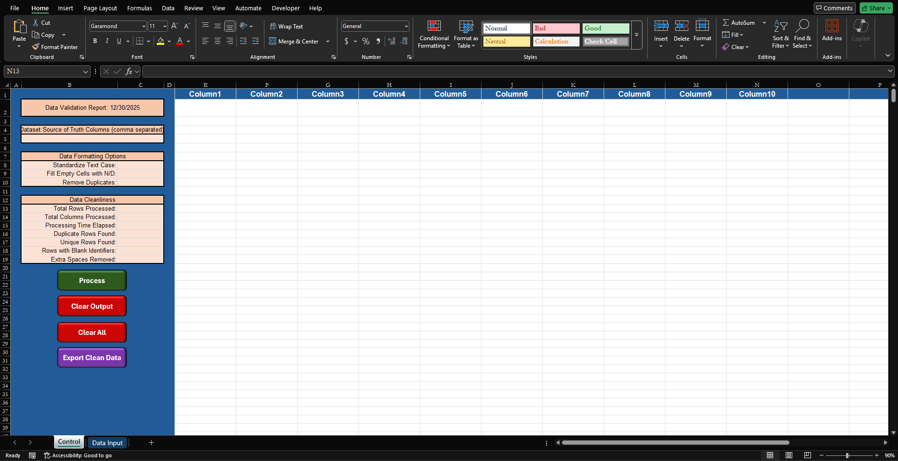

# data_hygienist_v1.0

## Overview

This is a lightweight Excel/VBA tool for basic data cleanup before analysis or import. It trims whitespace, standardizes text case, fills empty cells, flags or removes duplicate rows, and reports actionable metrics about data quality.

I built this after running into the same small data issues over and over during migration and reporting work. Extra spaces, inconsistent casing, duplicate rows, and partial records would take longer to fix manually than the time saved by automation. This tool automates those repetitive checks and leaves an audit trail.

---

## How It Works

1. Paste your dataset into the **Data Input** sheet (headers in row 1).
2. Use the **Control** sheet to configure options:
   - Choose identifier columns (optional)
   - Standardize text case
   - Fill blanks with `N/D`
   - Flag or remove duplicates
3. Click **Process** to run the cleaning cycle.

Cleaned data is written to the Control sheet starting in column E. Duplicates can optionally be moved to a separate **Duplicates** sheet instead of being deleted.

---

## Control Panel

Configure your cleanup options in the Control sheet, then click **Process** to run all four cleaning steps. Metrics are displayed in real-time showing rows processed, duplicates found, unique rows, and processing time elapsed.

---

## Exporting and Resetting

- **Export Clean Data** creates a new workbook containing only the cleaned dataset.
- **Clear Output** resets results and metrics while leaving the original input untouched.
- **Clear All** resets everything and requires confirmation.

---

## Notes

This tool intentionally avoids type coercion, date parsing, schema enforcement, or guessing. All changes are explicit, measurable, and reversible.

It has been tested on datasets exceeding 150,000 rows and is written in pure VBA for compatibility with both Windows and Mac versions of Excel.

---

**Intended use:** paste data → configure options → clean → review → export.